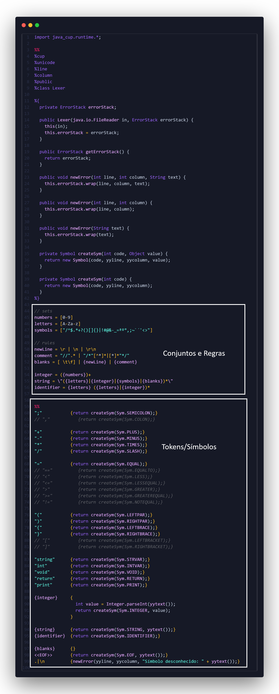
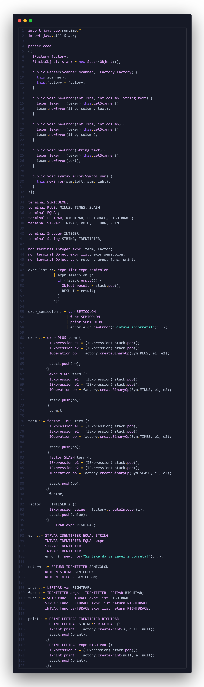
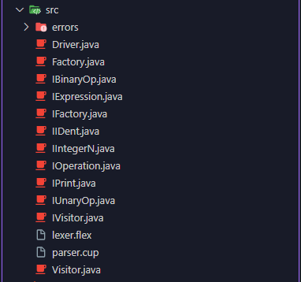
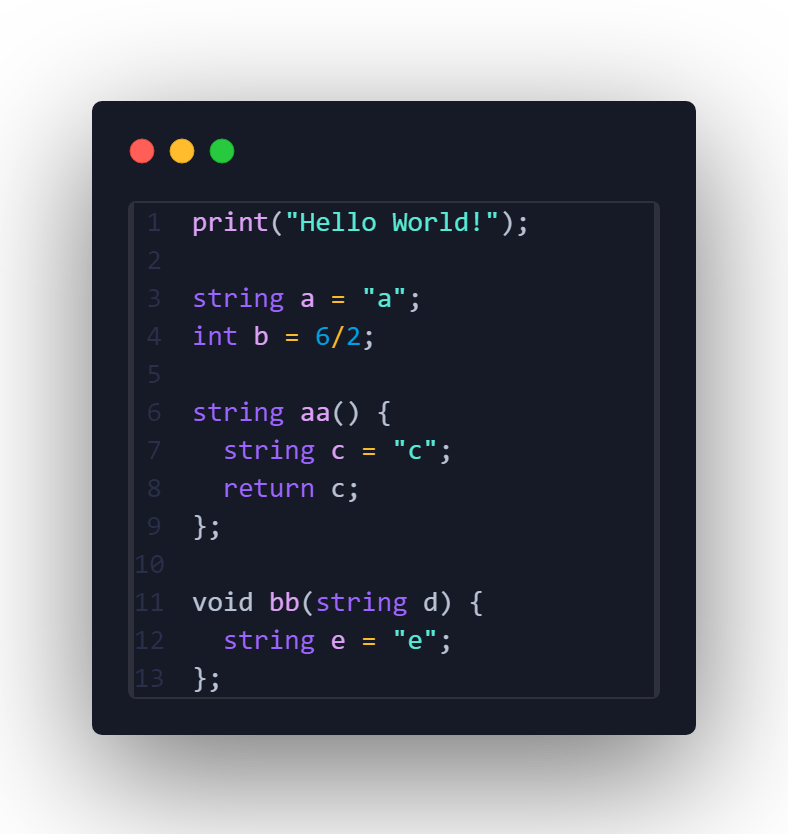
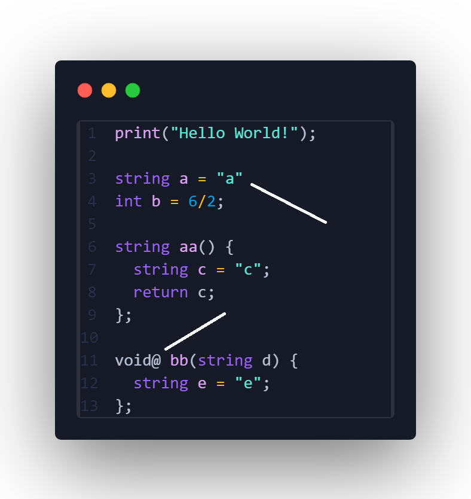
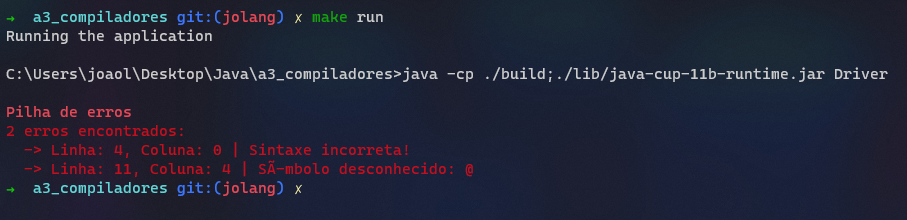
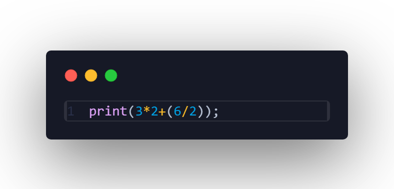
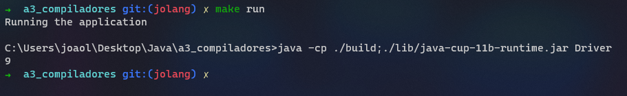

# JOLANG

Simples e minimalista linguagem de programação e compilador feito em **Java** com as bibliotecas **JFLEX** e **JCUP**. Projeto final A3 da UC Teoria da Computação e Compiladores da Unisociesc.

## Estrutura

Segue abaixo a estrutura de pastas e arquivos do projeto:

* **build**: contém as classes java compiladas;
* **lib**: contém as bibliotecas jflex e jcup .jar;
* **scripts**: contém os scripts .bat para a construção, compilação e execução;
* **src**: contém o código-fonte do compilador;
* **.gitignore**: arquivo que contém o caminho de arquivos e pastas a serem ignorados pelo GitHub;
* **main.jo**: arquivo que contém o código da linguagem de programação a ser compilada;
* **Makefile**: arquivo make para a execução prática dos scripts;
* **README.md**: arquivo contendo informações do projeto.

## Dependências

* Java JRE e JDK Oracle ou OpenJDK **(Obrigatório)**;
* Make (Opcional)

[Oracle JRE](https://www.java.com/pt-BR/)

[Oracle JDK](https://www.oracle.com/br/java/technologies/downloads/)

[OpenJDK](https://openjdk.org/)

### Windows

```powershell
choco install make
```

### MacOS

```zsh
brew install make
```

### Linux

```bash
sudo apt install make
```

## Executando

Para executar basta executar os scripts da pasta scripts na seguinte ordem:

1. build.bat
2. compile.bat
3. run.bat

Ou utilizando a ferramenta make:

```terminal
make build && make run
```

## Explicação

### Análise Léxica

O analisador léxico é o responsável por ler o código fonte e retornar os tokens encontrados, é no léxico que se determina quais caracteres, simbolos, letras e números além de suas combinações serão suportadas pela linguagem. Neste projeto a definição de símbolos e tokens é feita no arquivo **lexer.flex**.

Na imagem abaixo é definido os conjuntos a serem utilizados como: letras, números, símbolos especiais, etc. Mais abaixo é definido algumas regras utilizando expressões regulares, nesse caso são definidas as regras para identificaçao de strings, inteiros e identificadores e na seqûencia a criação de símbolos depois dos **%%** como: () {} + / print void etc.



### Análise Sintática

O analisador sintático é responsável por derteminar quais regras, estruturas e combinações dos tokens gerados na etapa anterior são válidas. Nessa etapa são definidas as regras da linguagem e sua estrutura "gramatical" definindo quais são os termos e "frases", assim como suas combinações, a serem utilizados no código-fonte. Nesse projeto a definição da sintaxe foi feita no arquivo **parser.cup** onde foram definidas estruturas para variáveis, funções, expressões matemáticas e o print como mostrado na imagem abaixo:



É nessa etapa também que são definidos os erros e uma ponte com a parte semântica onde se dá o sentido a essas expressões e estruturas sintáticas.

### Análise Semântica

A análise semântica está intimamente ligada a etapa anterior pois é com base nas estruturas sintáticas definidas e analisadas como válidas é que definimos qual será o "comportamento"/função de cada estrutura gramatical. Nesse projeto a parte semântica foi dividia em classes onde as classes principais são a Factory e a Visitor, ambas trabalham em conjunto para criar instâncias das outras classes e permitir que essas instâncias sejam visitadas e executem funções conforme o necessário.

Na etapa anterior utilizamos a classe factory para criar as instâncias adequadas para as estruturas gramaticais, como por exemplo, as definições expr, term e factor se válidas instânciam as classes responsáveis por realizar os cálculos matemáticos. Segue na imagem abaixo algumas das classes:



## Objetivo e Demo

O objetivo principal é validar o código-fonte inserido no arquivo **main.jo** verificando se o mesmo contém os tokens e a sintaxe correta além de executar cálculos matemáticos e exibi-los na tela através da estrutura sintática **print**. Esse projeto possui validação para variáveis, funções e a estrutura print exibindo uma pilha de erros caso os mesmos não sejam válidos. Segue abaixo imagens referentes a estrutura correta do código-fonte e os erros gerados caso alguma linha não corresponda com as regras definidas nas etapas anteriores.

**Código-fonte correto:**



**Código-fonte errado:**



Como mostra a imagem acima, esse código-fonte possui dois erros: uma falta de **ponto e vírgula** na linha 03 e um **símbolo especial** na palavra reservada **void** na linha 11. Como resultado temos uma pilha com 02 erros como mostra a imagem abaixo:



Os erros acima contém linha e coluna aproximada de onde o compilador achou a excessão. Os erros são definidos na Análise Sintática e Semântica caso o código-fonte contenha sintaxes inválidas.

Segue abaixo aogra um exemplo do código-fonte rodando com a sintaxe válida:





## Equipe

João Lucas Oliveira Sereia - RA122112337

Guilherme Eduardo Corso Maffei - RA122125528

Ciência da Computação, UC Teoria da computação e compiladores - Unisociesc/Anita Garibaldi
